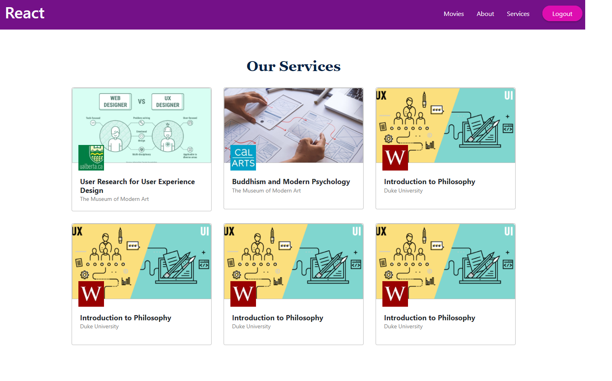

# Getting Started with Create React App

This project was bootstrapped with [Create React App](https://github.com/facebook/create-react-app).

## Pages 

1- Login
2- Movies
3- About
4- Services
## Components
About
MoviesPage
Login
MainHeader
Services
Navigation
## Reusable components

Card
Button
Movie
MovieList

##  1-Login Page 
A component with form for submitting user Email and Password

## Features 

1- Email Validation
2- Password Validation 
3-Form Validation 
4- Redirect the user to the Home component when the data is correct 
5- useEffect Hook to handle sideEffects
6- using the reusable Card component to wrap the form inside it

________________________________________________

## 2- Movies Page 

-after the user login in successfully he will be redirect to the Movies page 
-we handle this step in the Home Component with a very simple UI to describe the process 

-we note here in the attached image the navigation bar links have 2 cases 
1- if the user is not logged in it will not appear
2- after the user logged in the links appears 

## Movies workflow : 
- Here we get Movies data from a REST API "https://swapi.dev/api/films/"
- We send a GET request to the API by clicking on the 
"Click to Fetch Movies" Button 
-we have initial state  " Found no movies click above to fetch "
- then the "Loading state" to  make user know that the data are on the way 
- finally, the data will be appear in the page and the "Loading state will disappear"

________________________________________________

## About Page 

here we represent another simple UI in the About component and link it to the about navigation link which will easily can be reached by clicking on the (about) Link 
- here we apply the concept of the SPA 

_________________________________________________

## Services Page 

- and finally the third UI is a simple Services page that display dummy services data 

